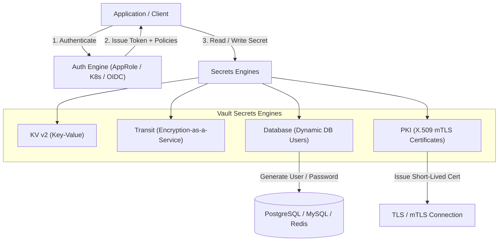
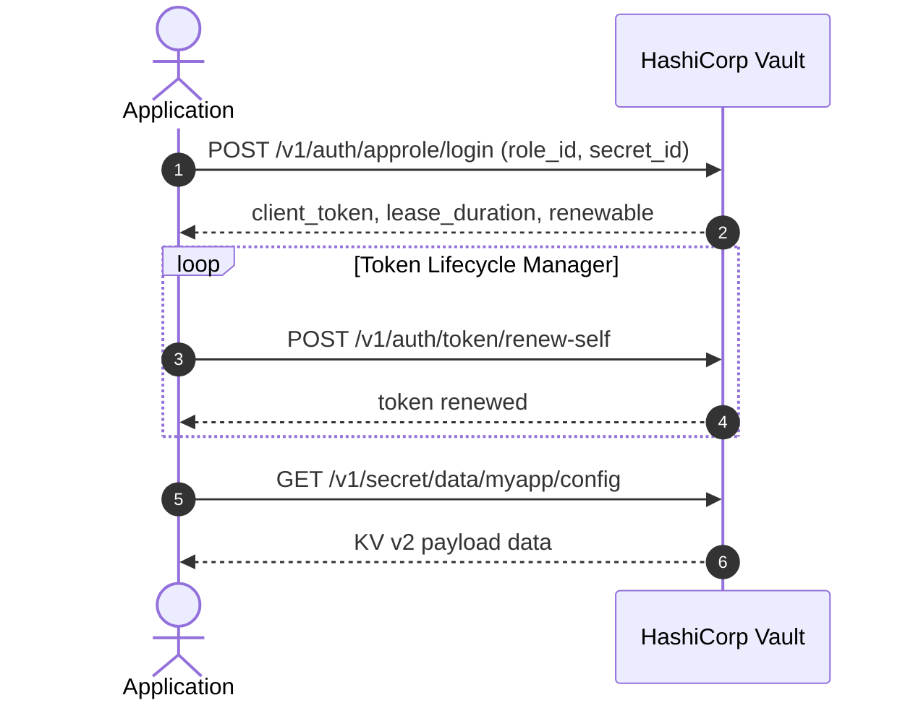

# 🔐 HashiCorp Vault Integration — System Architecture & Specification

Comprehensive reference architecture, integration patterns, and implementation specification for integrating applications and infrastructure with **HashiCorp Vault**.

---

## 1. Objectives & Overview

HashiCorp Vault is an identity-based secrets and encryption management system. This specification defines standard integration patterns, lifecycle workflows, security controls, and reference implementations for securing secrets across modern application architectures.

### Primary Goals
1. **Zero Hardcoded Secrets**: Eliminate plaintext secrets from source code, config files, container images, and CI/CD pipelines.
2. **Dynamic & Ephemeral Credentials**: Prefer just-in-time, short-lived, auto-revoking credentials over static long-lived credentials.
3. **Encryption-as-a-Service (Transit)**: Protect sensitive data at rest (e.g., PII, tokens) using Vault-managed keys without exposing cryptographic keys to application runtimes.
4. **Automated Secret Rotation & Token Lifecycle**: Implement automatic leasing, renewal, and failure-handling strategies.
5. **Multi-Environment Parity**: Provide consistent developer workflows from local containerized Vault dev instances to production clusters.

---

## 2. Directory & Project Structure

```
hashicorp-vault-integration/
├── SPEC.md                           # System architecture and integration specification
├── README.md                         # Quickstart guide & development setup
├── docker-compose.yml                # Local Vault dev cluster with auto-configuration
├── config/
│   ├── vault.hcl                     # Vault server configuration
│   └── policies/                     # Granular Vault HCL ACL policies
│       ├── app-policy.hcl            # Application runtime policy (read-only KV + transit)
│       ├── db-dynamic-policy.hcl     # Dynamic DB credentials policy
│       └── pki-issue-policy.hcl      # PKI certificate generation policy
├── terraform/                        # Infrastructure-as-Code for Vault setup
│   ├── main.tf                       # Mounts, auth backends, secrets engines
│   ├── policies.tf                   # ACL policy definitions
│   └── roles.tf                      # AppRole / K8s roles configuration
├── examples/                         # Reference implementations & SDK patterns
│   ├── go/                           # Go client (hashicorp/vault/api)
│   ├── rust/                         # Rust client (vaultrs)
│   ├── python/                       # Python client (hvac)
│   ├── nodejs/                       # Node.js client (node-vault / @azure/keyvault or axios)
│   └── kubernetes/                   # K8s Vault Agent Injector & CSI configurations
└── scripts/
    ├── init-vault-dev.sh             # Auto-provision KV engines, test secrets, and AppRoles
    └── rotate-secrets.sh             # Manual rotation and validation helper
```

---

## 3. Core Concepts & Vault Capabilities



### 3.1 Supported Secrets Engines
- **KV v2 (Key-Value)**: Versioned key-value storage with metadata, soft-delete, and rollback capabilities.
- **Transit (EaaS)**: Cryptographic operations (Encrypt, Decrypt, Sign, Verify, HMAC, Generate Random Bytes) without exposing private keys.
- **Database Engine**: Generates unique, ephemeral database credentials on-demand with automated TTL revocation.
- **PKI (Public Key Infrastructure)**: Generates dynamic X.509 certificates for microservice mTLS communication.

---

## 4. Integration Patterns

### Pattern 1: Direct SDK Integration (In-App Client)
The application directly communicates with the Vault REST API using official or community SDKs (`hvac`, `vault/api`, `vaultrs`).

- **Pros**: Fine-grained programmatic control, dynamic re-fetching, runtime encryption with Transit engine.
- **Cons**: Code coupled to Vault SDK, requires in-app token renewal loop.
- **Best For**: Microservices requiring Transit field-level encryption, dynamic credential rotation, and rich SDK features.



---

### Pattern 2: Sidecar & Init Container (Kubernetes Vault Agent Injector)
Vault Agent runs as an Init Container or Sidecar injected into application pods via annotations.

- **Annotations Example**:
  ```yaml
  vault.hashicorp.com/agent-inject: "true"
  vault.hashicorp.com/role: "myapp-role"
  vault.hashicorp.com/agent-inject-secret-config: "secret/data/myapp/database"
  vault.hashicorp.com/agent-inject-template-config: |
    {{- with secret "secret/data/myapp/database" -}}
    DATABASE_URL=postgres://{{ .Data.data.username }}:{{ .Data.data.password }}@db:5432/main
    {{- end }}
  ```
- **Pros**: Zero application code changes; secrets written to `/vault/secrets/` in-memory `tmpfs` mount.
- **Cons**: Kubernetes-specific; requires template-based configuration.

---

### Pattern 3: Dynamic Database Credentials
Applications request ephemeral database credentials instead of static shared users.

1. Application queries `/v1/database/creds/readonly-role`.
2. Vault connects to the database as superuser and generates a short-lived user (e.g. `v-app-readonly-abcd1234-1695...`).
3. Vault returns username, password, and lease ID (e.g. TTL 1 hour).
4. Application uses credentials and renews lease periodically.
5. When lease expires or pod terminates, Vault automatically issues `DROP ROLE` on the database.

---

### Pattern 4: Transit Encryption-as-a-Service (Envelope / Field Encryption)
Used to encrypt Sensitive Personally Identifiable Information (PII) before saving to application databases.

- **Encrypt**:
  `POST /v1/transit/encrypt/customer-key` with Base64 plaintext $\rightarrow$ returns ciphertext: `vault:v1:86j9+7...`
- **Decrypt**:
  `POST /v1/transit/decrypt/customer-key` with ciphertext $\rightarrow$ returns decrypted Base64 plaintext.
- **Key Rotation**: Vault rotates underlying cryptographic keys with zero downtime; old ciphertext can be re-wrapped (`/v1/transit/rewrap/customer-key`) without re-entering plaintext.

---

## 5. Authentication Methods & Token Management

| Auth Method | Target Environment | Security Characteristics |
| :--- | :--- | :--- |
| **AppRole** | VMs, Non-K8s containers, CI/CD | Two-factor secret delivery (`role_id` baked or via config, `secret_id` injected via pipeline) |
| **Kubernetes Auth** | EKS, GKE, AKS, Vanilla K8s | Authenticates using standard Kubernetes Service Account JWT (`/var/run/secrets/...`) |
| **JWT / OIDC** | GitHub Actions, GitLab CI | Keyless OIDC federation directly with CI workflows |
| **AWS IAM / Azure MSI** | Cloud instances & Lambdas | Authenticates via signed AWS STS / Azure Managed Identity requests |

### Token Renewal & Graceful Error Handling Rule
1. **Background Renewal**: Token renewer thread wakes up at `0.5 * TTL` (or `TTL - 60s`) and issues `POST /v1/auth/token/renew-self`.
2. **Re-authentication on Expiration**: If renewal returns `403 Forbidden` (lease expired / token revoked), trigger immediate full re-authentication.
3. **In-Memory Caching**: Cache KV secrets with TTL metadata to prevent hammering the Vault cluster.

---

## 6. Access Control & Least Privilege Policies

Policies use declarative HCL syntax:

```hcl
# Read-only access to specific KV v2 secrets path
path "secret/data/myapp/*" {
  capabilities = ["read"]
}

path "secret/metadata/myapp/*" {
  capabilities = ["list", "read"]
}

# Transit field encryption and decryption
path "transit/encrypt/myapp-key" {
  capabilities = ["update"]
}

path "transit/decrypt/myapp-key" {
  capabilities = ["update"]
}

# Dynamic database credentials creation
path "database/creds/myapp-db-role" {
  capabilities = ["read"]
}

# Deny everything else by default
path "*" {
  capabilities = ["deny"]
}
```

---

## 7. Local Development & Testing Workflow

### 7.1 Spin Up Dev Environment
```bash
docker compose up -d
./scripts/init-vault-dev.sh
```

### 7.2 Verify Auth & Read Secret
```bash
export VAULT_ADDR="http://127.0.0.1:8200"
export VAULT_TOKEN="root"

# Verify status
vault status

# Read test KV secret
vault kv get secret/myapp/config
```

---

## 8. Implementation Roadmap

- [x] Create project structure and architectural specification (`SPEC.md`).
- [ ] Add `docker-compose.yml` with Vault, PostgreSQL, and Vault UI.
- [ ] Implement automated provisioning script `scripts/init-vault-dev.sh`.
- [ ] Add Terraform / OpenTofu provisioning modules in `terraform/`.
- [ ] Provide multi-language SDK client examples:
  - [ ] Go client (`examples/go`)
  - [ ] Rust client (`examples/rust`)
  - [ ] Python client (`examples/python`)
- [ ] Add Kubernetes Vault Agent Injector & External Secrets Operator manifest examples.
